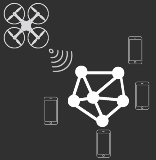
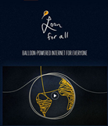
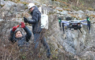

#6조. 스페이스 스테이션

| 학과 | 학번 | 이름 | id | 분반 | 지도교수 |
| :------: | :------ |:-----: |  :------: | ------: | :------: |
| 컴공 | 2011136026 | 김정원 | kjwkjwkjw | 01 | 강승우 교수님 |
| 컴공 | 2011136131 | 최의성 | ChoiUiSeong | 01 | 강승우 교수님 |
| 컴공 | 2012136106 | 이하늘 | shrinehaneal | 01 | 강승우 교수님 |

>###목차
	1. 필요성
	2. 시스템 개요
	3. 기존 제품 조사 및 분석
 

------------------------
###**1.필요성**

####최근 우리나라에도 ***지진***이 연달아 발생하면서 통신 마비로 인한 불안감이 증가하고 있다. 지진 발생 시 이동통신 통화량이 10배나 증가하고, 카카오톡이 마비되기도 한다. 도심의 주요기업들이 업무를 제대로 볼 수 없는 문제도 생겨나고 있다. 이러한 문제점을 해결하고자 통신기지국을 설치하는 여러 가지 방법이 시행되었다. 하지만 교통 마비에 따른 빠른 대처가 불가능 하다는 문제점이 있었다. 지상에서는 기지국을 이용할 수 없다는 결과가 나오게 되었다. 또한 2006. 12. 26. 대만 남부 해저에서 강진이 발생하였는데, 이 때 해저 케이블을 통한 전용선 방식으로 네트워크를 구성한 홍콩 은행들은 전혀 손을 쓸 수 없이 대처하지 못했다. 따라서 통신 마비로 인해 *국제금융통신망(SWIFT)* 장애가 발생하였다. 은행은 결제 불능 상태에 이르렀고, 수출입 기업 역시 치명적인 피해를 입었다. 이러한 문제를 해결하고자 등장한 방법 중 인기를 끌고 있는 것이 드론을 이용한 기지국을 설계하는 것이다. **드론을 활용하여 해당 지점으로 이동하고 그 지점에서 기지국 역할을 해주는 방식이다.** 하지만 드론이 기지국 역할도 하며 제자리에 계속 떠 있어야 하므로 많은 배터리가 소모된다. 따라서 최대 2시간 가량 밖에 떠 있지 못해서 드론을 계속 교체해줘야 하는 불편함이 따른다. 이러한 불편함을 해결 하고자 스페이스 스테이션 시스템을 제안한다. 이는 드론을 활용하여 해당 지점으로 이동하는 것 까지는 동일하다. 여기서 드론이 기지국 역할을 하는 것이 아니라 풍선 및 열기구와 같은 장치와 함께 이동하여 풍선 및 열기구가 기지국의 역할을 하는 것이다. 드론과는 달리 계속 떠 있을 수 있으므로 문제점을 해결할 수 있다. 또한 일부지역 드론이 네트워크 단절 시 위치정보 기반 서비스에 따라 새로운 드론이 해당 지역으로 이동하게 되고 단절 된 지역의 드론은 착륙하게 된다. 새로운 드론이 이를 대처하는 것이다. 즉, 풍선 및 열기구와 같은 장치는 정거장의 역할을 한다. 열기구를 이용하는 방법으로는 현재 구글의 룬 프로젝트가 있다. 룬 프로젝트는 기지국이 공중에 있다는 기술은 같지만, 재해 재난 상황에서 신속한 대처가 불가능하다. 드론을 활용하여 풍선을 이동시키는 ***스페이스 스테이션 시스템***이 신속하여 이점이 크다.
-----------------------

###**2. 시스템 개요**

| 시스템  | 사진 | 정의 |
| :-----: | :-----:  | :-----:  |
| 스페이스 스테이션 |  | 지진 발생시 통신 마비 현상을 해결하기 위해 드론을 활용한 간이 기지국을 설계하여 지진 피해자에 통신마비에 따른 불안감을 해소 시킴. |

--------------

###**3. 기존 제품 조사 및 분석**
 
> | 이름 | 사진 | 설명 | URL |
| :-----: | :------: | :------: | :-------:|
| 구글 프로젝트 룬 |  |  여러 개의 풍선이 떠다니면서 인터넷을 지원해주는 시스템 | [link](https://brunch.co.kr/@bruncho7zx/16)|
| KT 드론 기지국 |  |  다수의 드론에 LTE 가 장착된 단말기를 사용하여 한꺼번에 공중으로 띄워 통신 커버리지를 확보 | [link] [Arbitrary case-insensitive reference text] |
[arbitrary case-insensitive reference text]:http://www.newsis.com/ar_detail/view.html?ar_id=NISX20151124_0010435940
